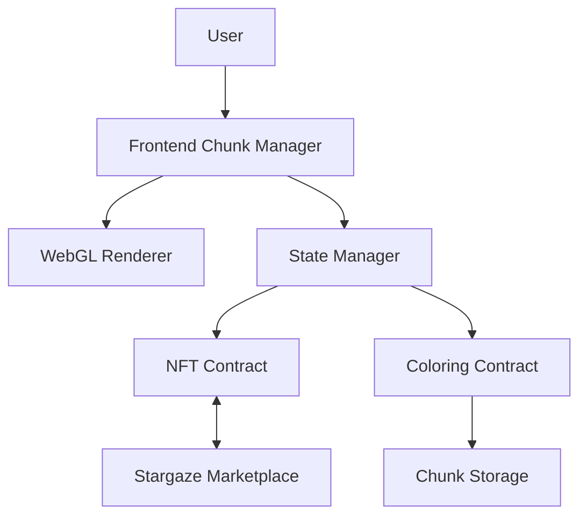

# Mosaic Technical Specification

## Overview
Mosaic is a decentralized pixel art platform built on the Stargaze blockchain. It combines NFT ownership with dynamic color management, allowing users to own, trade, and customize pixels on a shared canvas of 100 million pixels (10,000 x 10,000).

## Architecture

### Core Components

1. NFT Contract (Area-based sg721)
   - Handles 10x10 pixel area ownership (1M NFTs)
   - Integrates with Stargaze marketplace
   - Manages area metadata
   - Coordinates with coloring contract

2. Coloring Contract (Chunked CosmWasm)
   - Manages pixel colors in 100x100 chunks
   - Handles color rental system
   - Implements time-based permissions
   - Manages fee collection
   - Optimized state management

3. Frontend Application (Next.js)
   - Chunked canvas rendering
   - WebGL acceleration
   - Progressive loading
   - Level of Detail (LOD) system

### Scaling Architecture


### Storage Architecture
1. Area NFTs (1M total)
   - 10x10 pixel areas
   - ~100 bytes per NFT
   - Total: ~100MB state

2. Color Chunks (10,000 total)
   - 100x100 pixel chunks
   - Sparse color storage
   - ~10KB per chunk
   - Total: ~100MB state

## Features & Roadmap

### Phase 1: Core Functionality (Q1 2024)
- [x] Basic area ownership (NFTs)
- [ ] Chunked color management
- [x] Wallet integration
- [ ] WebGL canvas rendering
- [ ] Basic color rental system

### Phase 2: Enhanced Features (Q2 2024)
- [ ] Advanced chunk management
- [ ] Progressive loading
- [ ] Level of Detail system
- [ ] User dashboard
- [ ] Image upload & pixelization

### Phase 3: Advanced Features (Q3 2024)
- [ ] Dynamic pricing
- [ ] Area reservation system
- [ ] Analytics dashboard
- [ ] API access
- [ ] Performance optimizations

### Phase 4: Platform Extensions (Q4 2024)
- [ ] Mobile optimization
- [ ] Governance system
- [ ] Revenue sharing
- [ ] Cross-chain integration
- [ ] Advanced analytics

## Technical Implementation

### Chunk Management
```typescript
interface Chunk {
    id: string;          // "x:y" coordinates
    size: number;        // 100x100 pixels
    pixels: Map<string, Color>;  // Sparse storage
    lastUpdated: number;
}

interface ChunkManager {
    visibleChunks: Set<string>;    // Currently visible chunks
    loadedChunks: Map<string, Chunk>;  // Chunk cache
    pendingLoads: Set<string>;     // Loading queue
}
```

### WebGL Rendering
```typescript
interface RenderManager {
    scale: number;           // Current zoom level
    viewport: Viewport;      // Visible area
    textures: Map<string, WebGLTexture>;  // Chunk textures
    shaders: ShaderProgram;  // Pixel rendering shaders
}
```

### State Management
```typescript
interface StateManager {
    chunks: ChunkManager;
    render: RenderManager;
    ownership: AreaManager;
    updates: UpdateQueue;
}
```

## Pricing Model

### NFT Operations
1. Area Minting (10x10 pixels)
   - Base cost: 1 STARS
   - Dynamic pricing based on position
   - Premium for edge/corner positions

2. Trading
   - Market-driven prices
   - Platform fee: 2.5%
   - Royalties: 5%

### Color Operations
1. Owner Color Setting
   - Gas fees only (~0.1 STARS per operation)
   - Batch operations available

2. Color Rental
   - Base rate: 0.1 STARS/day/pixel
   - Minimum area: 10x10 pixels
   - Maximum rental period: 30 days

3. Bulk Operations
   - Discount for large areas
   - Premium for prime locations
   - Volume-based pricing tiers

## Performance Considerations

1. Canvas Rendering
   - WebGL-based rendering
   - Texture-based chunk caching
   - Hardware acceleration
   - Progressive enhancement

2. Data Management
   - Chunked loading (100x100 pixels)
   - LRU cache for chunks
   - Background preloading
   - Delta updates

3. Contract Optimization
   - Sparse storage patterns
   - Batched queries
   - Indexed lookups
   - Event sourcing

## Security Measures

1. Contract Security
   - Access control per area
   - Rate limiting
   - Pause mechanisms
   - Upgrade path

2. Frontend Security
   - Chunk validation
   - State verification
   - Rate limiting
   - Error recovery

3. Economic Security
   - Minimum stakes
   - Slashing conditions
   - Insurance pool

## Development Guidelines

1. Code Quality
   - Test coverage requirements
   - Documentation standards
   - Review process
   - Performance benchmarks

2. Deployment Process
   - Chunk verification
   - State migration
   - Rollback procedures
   - Monitoring setup

3. Maintenance
   - Chunk rebalancing
   - State cleanup
   - Cache invalidation
   - Performance tuning